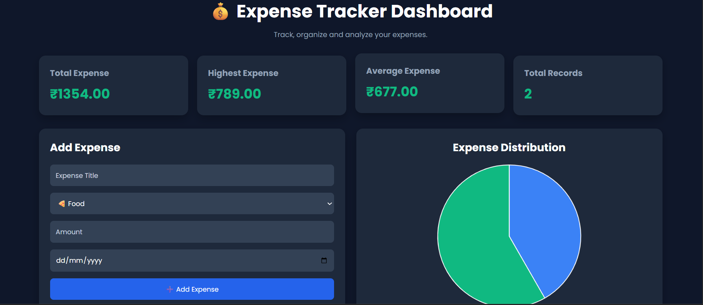
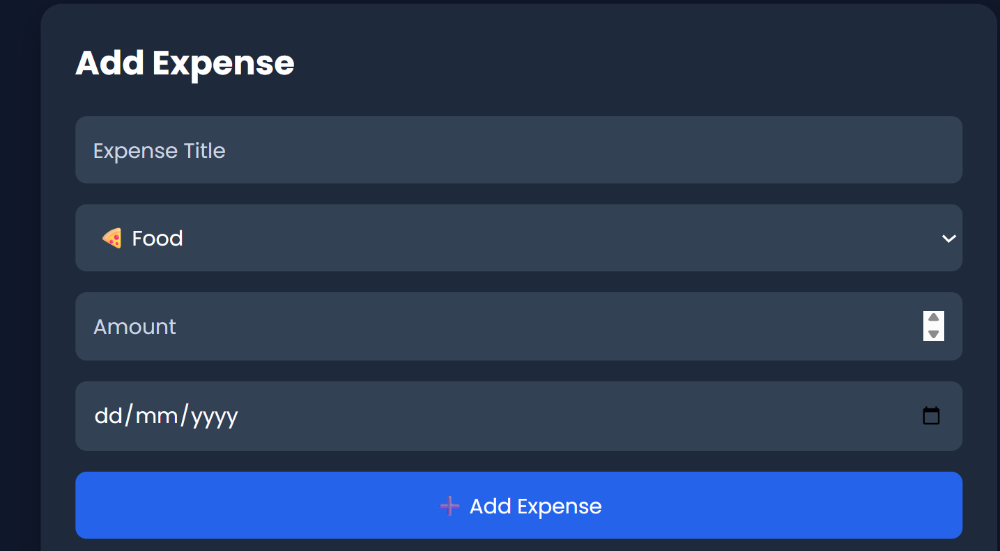
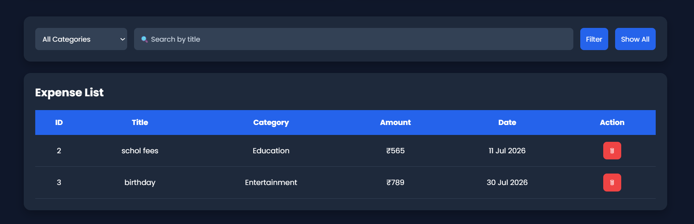
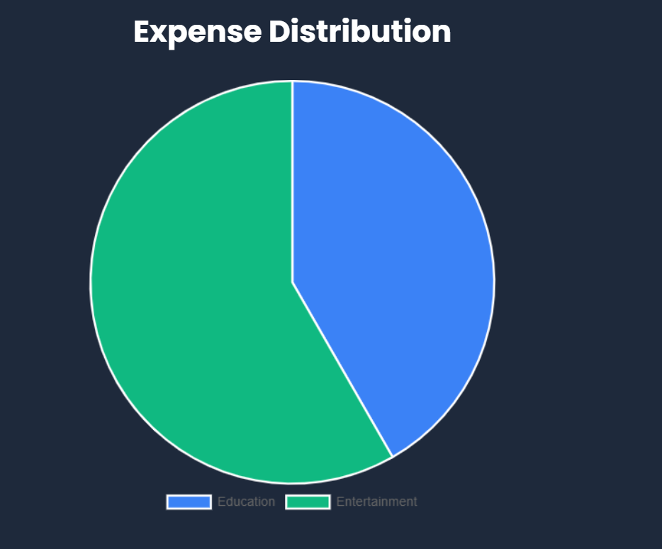
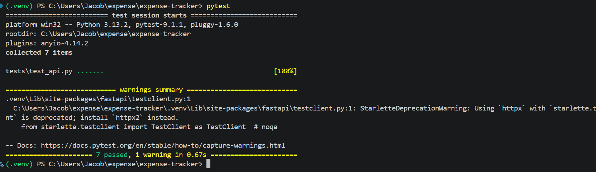

# Expense Tracker API

A modern Expense Tracker REST API built with **FastAPI** featuring an interactive dashboard for managing personal expenses. The application allows users to add, view, filter, analyze, and delete expenses while visualizing spending patterns through charts.

# Setup Instructions

## Prerequisites

- Python 3.10 or higher
- pip package manager
- Git (optional)

---

## Installation

### 1. Clone the repository

```bash
git clone <your-github-repository-url>
cd expense-tracker
```

### 2. Create a virtual environment

```bash
python -m venv .venv
```

### 3. Activate the virtual environment

Linux / macOS

```bash
source .venv/bin/activate
```

Windows (PowerShell)

```powershell
.\.venv\Scripts\Activate.ps1
```

Windows (Command Prompt)

```cmd
.venv\Scripts\activate.bat
```

### 4. Install dependencies

```bash
pip install -r requirements.txt
```

### 5. Start the server

```bash
uvicorn src.main:app --reload
```

### 6. Open the application

Dashboard

``` 
http://127.0.0.1:8000/
```

Swagger Documentation

```
http://127.0.0.1:8000/docs
```

---

# Key Features

## 1. Expense Management

- Add a new expense
- Delete existing expenses
- Automatic ID generation
- JSON-based storage

---

## 2. Interactive Dashboard

- Responsive dashboard UI
- Add expenses using forms
- Delete expenses with one click
- Search expenses
- Filter expenses by category

---

## 3. Expense Analytics

- Total expenses
- Highest expense
- Average expense
- Total number of expenses
- Pie chart visualization by category

---

## 4. REST API

- POST Expense
- GET All Expenses
- GET Expenses by Category
- GET Total Expenses
- GET Total Expenses by Category
- DELETE Expense

Swagger UI is available for testing all endpoints.

---

# Quick Start

## Install Dependencies

```bash
pip install -r requirements.txt
```

## Run the Application

```bash
uvicorn src.main:app --reload
```

## Open

Dashboard

```
http://127.0.0.1:8000/
```

Swagger

```
http://127.0.0.1:8000/docs
```

---

# API Endpoints

| Method | Endpoint | Description |
|----------|-------------------------------|----------------------------|
| POST | /expenses | Add a new expense |
| GET | /expenses | Get all expenses |
| GET | /expenses/category/{category} | Filter by category |
| GET | /expenses/total | Get overall total |
| GET | /expenses/total/{category} | Get category total |
| DELETE | /expenses/{id} | Delete expense |

---

# Usage Guide

## Adding an Expense

1. Enter the expense title.
2. Select a category.
3. Enter the amount.
4. Choose a date.
5. Click **Add Expense**.

---

## Viewing Expenses

The dashboard automatically displays all expenses in a table.

---

## Filtering Expenses

- Select a category.
- Click **Filter**.

Click **Show All** to reset the filter.

---

## Searching Expenses

Type the expense title in the search box to filter matching expenses.

---

## Deleting Expenses

Click the delete button beside any expense.

---

# Technologies Used

## Backend

- FastAPI
- Python
- Pydantic
- Uvicorn

---

## Frontend

- HTML5
- CSS3
- JavaScript
- Chart.js

---

## Storage

- Local JSON File

---

# Project Structure

```
expense-tracker/
│
├── README.md
├── AI_NOTES.md
├── requirements.txt
├── .gitignore
│
├── src/
│   ├── __init__.py
│   ├── main.py
│   ├── models.py
│   ├── routes.py
│   ├── services.py
│   └── storage.py
│
├── templates/
│   └── index.html
│
├── static/
│   ├── css/
│   │   └── style.css
│   └── js/
│       └── script.js
│
├── data/
│   └── expenses.json
│
├── screenshots/
│   ├── add-expense.png
│   ├── dashboard.png
│   ├── filter-expense.png
│   ├── pie-chart.png
│   └── tests.png
│
└── tests/
    ├── __init__.py
    └── test_api.py
```

---

# Design Decisions

### FastAPI

Chosen because of:

- Automatic API documentation
- Fast development
- Built-in validation
- Excellent performance

---

### JSON Storage

A local JSON file was used instead of a database .

---

### Interactive Dashboard

A lightweight HTML, CSS, and JavaScript frontend was added to provide an intuitive interface while keeping the backend as the primary focus.

---

### Layered Architecture

The project separates:

- Models
- Routes
- Services
- Storage

This improves maintainability and readability.

---

# Assumptions

- Expenses are stored locally.
- Categories are selected from predefined options.
- IDs are auto-generated.
- No user authentication is required.
- Single-user application.

---

# Testing

Run the test suite using:

```bash
pytest -v
```

The API was also manually tested using Swagger UI to verify:

- Expense creation
- Viewing expenses
- Filtering
- Total calculations
- Delete functionality

---

# Future Improvements

 The following enhancements will be added in future :

- SQLite/PostgreSQL integration
- User authentication
- Edit expense functionality
- Monthly analytics
- Budget tracking
- Export to CSV/PDF
- Dark/Light theme toggle
- Docker support
- CI/CD pipeline


# Screenshots

## Dashboard



---

## Add Expense



---

## Filter Expenses



---

## Expense Distribution



---


---

## Automated Tests

All API tests passed successfully.


---

Built using **FastAPI**, **HTML**, **CSS**, and **JavaScript** for a lightweight yet interactive expense tracking application.